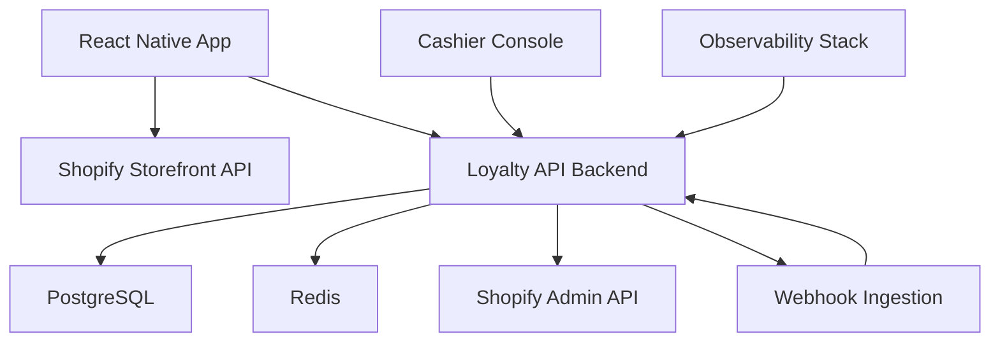
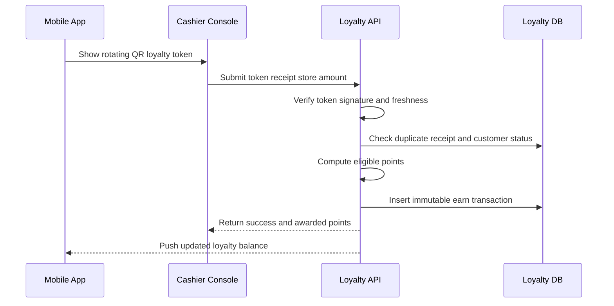

# Dacus.ro Standalone Mobile App Plan

## 1. Confirmed product direction

- Platforms: iOS and Android
- Mobile stack: React Native
- Commerce source: Shopify Storefront API for product catalog, product detail, collections, cart
- Checkout: Redirect to Shopify hosted checkout
- Authentication: Shopify customer accounts, loyalty profile mapped to Shopify customer ID
- Loyalty model:
  - Earn rate: 1 point for each 1 RON spent
  - Tiers by lifetime spend:
    - Bronze 0-1499 RON
    - Silver 1500-4999 RON
    - Gold 5000+ RON
  - Redemption: 100 points gives 5 RON discount by Shopify discount code
  - Earn only for paid and non-refunded orders
  - Physical store support: app QR loyalty ID scanned in-store, cashier validates purchase, backend awards points

## 2. Target architecture

### 2.1 Mobile app responsibilities

- Product browsing from Shopify collections and products
- PDP with variants, media, stock hints and pricing from Shopify
- Cart management via Storefront API cart operations
- Checkout handoff to hosted Shopify checkout URL
- Account area:
  - Shopify sign in and session handling
  - Loyalty balance, tier, transaction history
  - Loyalty QR code screen
- Reward center:
  - List available rewards by points balance
  - Claim reward to generate discount code
  - Show active and used rewards

### 2.2 Loyalty backend responsibilities

- Source of truth for points, tier, rewards and loyalty ledger
- Shopify webhook processing for orders, refunds and customer events
- Rule engine for accrual and tier computation
- Redemption engine for points conversion to Shopify discount codes
- In-store validation API for cashier flow
- Fraud controls, idempotency and audit trail

### 2.3 Integration boundaries

- Storefront API used by app for read commerce and cart
- Admin API used by backend for discount code generation and order validation
- Webhooks used for event driven loyalty updates
- Backend never trusts client point mutations

## 3. Shopify integration blueprint

### 3.1 Storefront API usage in app

- Collections query for home and category pages
- Product query for PDP and search
- Cart create and cart lines add update remove
- Checkout URL retrieval from cart for redirect
- Customer identity association after login

### 3.2 Admin API usage in backend

- Price rule and discount code lifecycle for loyalty redemption
- Order detail checks for paid status and refund reconciliation
- Customer metadata updates for non-critical mirrored fields if required

### 3.3 Required webhooks

- orders paid
- orders cancelled
- refunds create
- orders updated
- app uninstall

All webhook handlers must support:

- Signature verification
- Idempotency key handling
- Replay protection window
- Dead letter queue on repeated failures

## 4. Loyalty engine specification

### 4.1 Ledger model

- Immutable transactions only
- Transaction types:
  - EARN_ONLINE_ORDER
  - EARN_STORE_VALIDATED
  - REDEEM
  - REFUND_REVERSAL
  - MANUAL_ADJUSTMENT
  - EXPIRE
- Every transaction stores:
  - customer_id
  - source_reference
  - points_delta
  - balance_after
  - actor_type
  - reason
  - created_at

### 4.2 Accrual rules

- Online orders:
  - Grant after order is paid
  - Exclude shipping and taxes by default for safer margin policy
  - Exclude refunded line items from final earned amount
- Physical store:
  - Grant after cashier validation of proof and amount
  - Prevent duplicate claim by unique receipt key and store ID

### 4.3 Tier rules

- Tier calculated from lifetime eligible spend
- Tier transitions evaluated after each eligible event
- Tier downgrade policy:
  - No downgrade based on current lifetime model

### 4.4 Redemption rules

- Conversion fixed: 100 points to 5 RON
- Minimum redemption unit: 100 points
- Create single use discount code per redemption event
- Bind code usage to the same Shopify customer when possible
- Mark reward as consumed after confirmed order use

### 4.5 Refund handling

- Full refund reverses full earned points
- Partial refund reverses proportional points
- If customer lacks points at reversal time:
  - allow negative balance or create pending debt policy flag

## 5. In-store QR validation flow

### 5.1 Anti-fraud controls

- Rotating short lived QR token signed by backend secret
- Cashier role based access with per store scope
- Receipt uniqueness by store receipt number date amount hash
- Daily per customer and per cashier anomaly thresholds
- Manual review queue for suspicious patterns

## 6. Security and compliance baseline

- OAuth tokens and API secrets stored in secret manager only
- TLS everywhere and certificate pinning consideration for app API domain
- PII minimization and encrypted at rest database columns for sensitive fields
- GDPR baseline:
  - data access export
  - consent records
  - deletion workflow with legal retention boundaries
- Audit logging for loyalty mutations and cashier actions
- Rate limiting on auth, redemption and in-store validation endpoints

## 7. Reliability and operations

- Environments: dev, staging, production
- CI pipeline:
  - lint, typecheck, tests, security scan
  - build artifacts per environment
- CD pipeline:
  - backend rolling deployment
  - mobile release through TestFlight and Play internal track then production
- Observability:
  - structured logs with correlation ID
  - metrics for webhook lag, redemption errors, duplicate claim attempts
  - alerts for failed webhooks and discount generation failures
- Backup and recovery:
  - daily DB backup
  - restore drill cadence defined by runbook

## 8. Data model draft

- customers
- loyalty_accounts
- loyalty_transactions
- loyalty_tiers
- rewards
- reward_redemptions
- store_receipt_claims
- webhook_events
- cashier_users
- audit_logs

Indexes required on:

- customer_id
- source_reference unique constraints by event type
- created_at for time queries
- store receipt composite uniqueness

## 9. Phased implementation backlog with acceptance criteria

### Phase 1 Foundation

1. Create monorepo structure for mobile app and backend services
   - Acceptance: local build and tests run in clean environment
2. Implement environment config and secret management
   - Acceptance: no secrets in repo and startup validation passes
3. Set up PostgreSQL schema migrations and baseline tables
   - Acceptance: migrations apply and rollback cleanly

### Phase 2 Shopify commerce app shell

1. Implement Storefront API client and typed queries
   - Acceptance: collections and product detail load successfully
2. Implement cart operations and checkout redirect
   - Acceptance: cart persists and hosted checkout opens with expected lines
3. Implement Shopify customer login and session refresh
   - Acceptance: authenticated user can access account area reliably

### Phase 3 Loyalty core backend

1. Implement loyalty ledger service and transaction immutability
   - Acceptance: all point mutations recorded with audit fields
2. Implement accrual engine for paid online orders
   - Acceptance: paid order webhook grants expected points once only
3. Implement tier computation engine
   - Acceptance: tier updates match threshold rules after test scenarios

### Phase 4 Redemption and discount integration

1. Implement redemption API and points deduction logic
   - Acceptance: insufficient points blocked and valid redemption deducted
2. Implement Shopify Admin API discount code generation
   - Acceptance: generated code applies expected value in checkout
3. Implement reward usage reconciliation on order completion
   - Acceptance: reward marked used once and reconciles on cancellation

### Phase 5 In-store QR flow

1. Implement rotating QR token issuance in app
   - Acceptance: token expires and refreshes on schedule
2. Implement cashier validation console and backend endpoint
   - Acceptance: valid claim awards points and invalid token rejected
3. Implement duplicate receipt and anomaly protection
   - Acceptance: duplicate submission blocked and event logged

### Phase 6 Hardening and release

1. Add observability dashboards and critical alerts
   - Acceptance: alert triggers verified in staging
2. Add end to end tests across core purchase and loyalty journeys
   - Acceptance: CI blocks release on critical path failures
3. Run security and privacy checklist before store submission
   - Acceptance: checklist signed off and artifacts archived

## 10. Open implementation decisions for code phase

- Final backend framework choice for API service
- QR cashier console deployment target and device constraints
- Negative balance policy on refund reversals
- Exact discount combinability rules with existing Shopify promotions
